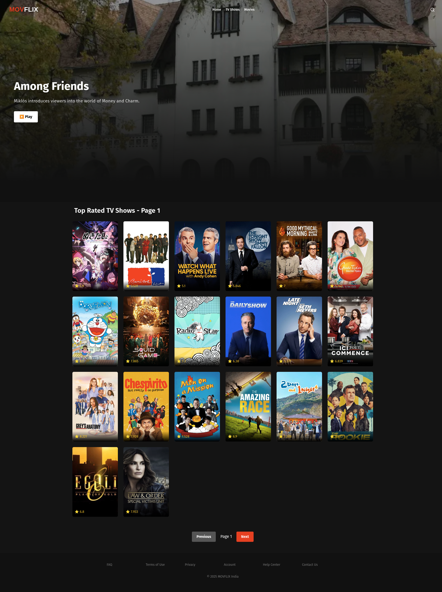

# MovFlix
A TMDB Based OTT Platform
<br>
<a href="https://mayankflix.netlify.app/">Live Demo</a>

<div>


</div>

## Setup Guide

1. Install the Dependencies
    ```bash
    bun install 
    ```

2. Rename .example.env to .env & replace YOUR_TMDB_API_KEY to your actual TMDB api key

3. Run the Application
    ```bash
    bun run dev
    ```
